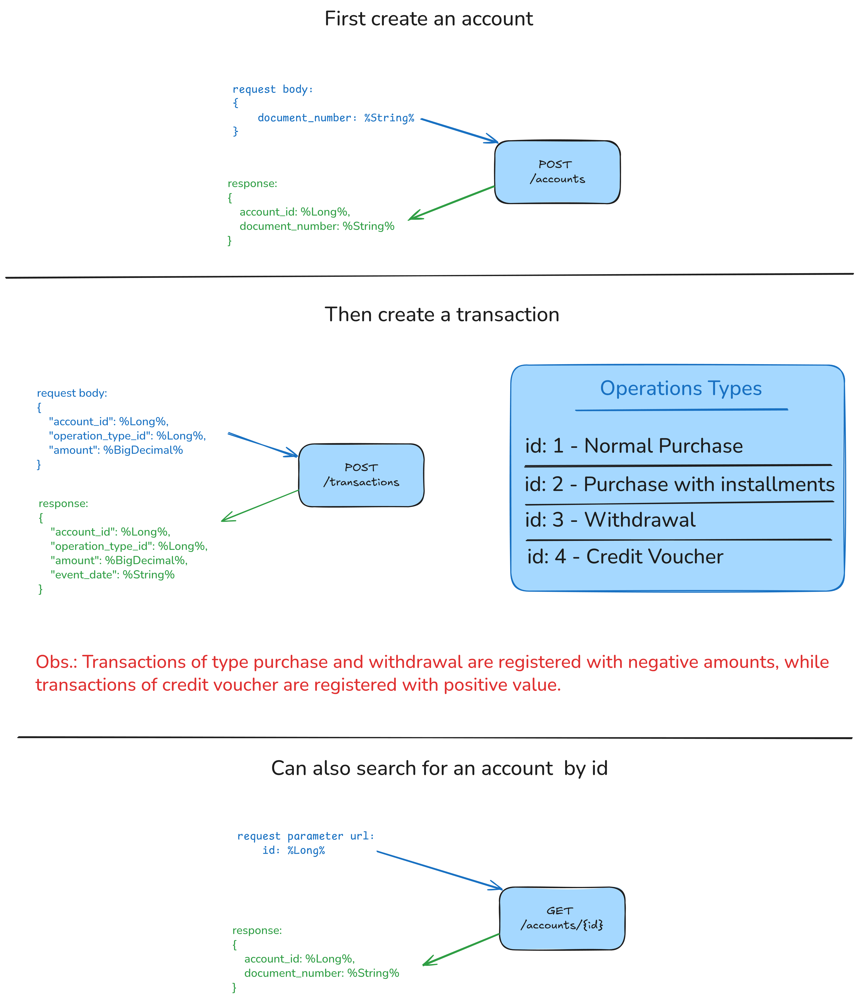

# Bank application


## 🔧 Requirements

For building and running the application you need:

- Java 21
- Docker & Docker Compose
- Maven Wrapper (`./mvnw`)

---

## 🗄️ Database
The application connects to a local PostgreSQL instance running on:

- Port: 5432

---

## 🌍 Application
The application runs on:

- Port: 8080

---

## ✅ Health Check
After the application is running, you can verify it with the health check endpoint:

http://localhost:8080/actuator/health

---

## 📘 Swagger
After the application is running, you can verify the swagger:

- Swagger UI: http://localhost:8080/swagger-ui.html

- OpenAPI Spec: http://localhost:8080/v3/api-docs

---

## Running the application locally

```shell
./mvnw clean package

sudo docker compose up --build
```

---

## Documentation

